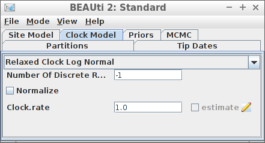

# babette_example_4

Branch   |[](https://travis-ci.org)                                                                                           |[](https://appveyor.com)                                                                                               
---------|--------------------------------------------------------------------------------------------------------------------------------------------------------|--------------------------------------------------------------------------------------------------------------------------------------------------------------------------------------------
`master` |[](https://travis-ci.org/richelbilderbeek/babette_example_4) |[](https://ci.appveyor.com/project/richelbilderbeek/babette-example-4/branch/master)
`develop`|[](https://travis-ci.org/richelbilderbeek/babette_example_4)|[](https://ci.appveyor.com/project/richelbilderbeek/babette-example-4/branch/develop)

A [babette example](https://github.com/richelbilderbeek/babette_examples).

## Example #4: Relaxed clock log normal



```{r}
posterior <- bbt_run(
  "my_alignment.fas",
  clock_model = create_rln_clock_model()
)
```

All other parameters are set to their defaults, as in BEAUti.

## Result


